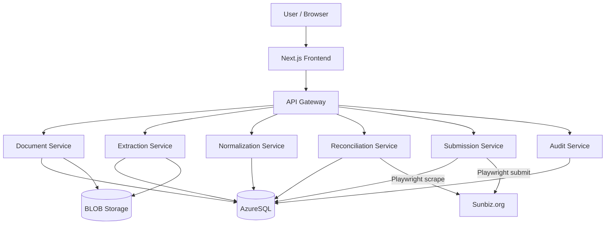

# System Architecture

## High-Level Design



## Component Breakdown

```mermaid
flowchart LR
    subgraph Frontend
        UI[Next.js App]
        Form[Form Rendering Engine]
        Upload[Document Upload UI]
    end

    subgraph Backend Services
        DS[Document Service]
        ES[Extraction Service - OCR + NLP]
        NS[Normalization Service - USPS API]
        RS[Reconciliation Service]
        SS[Submission Service - Playwright]
        AS[Audit Service]
    end

    subgraph Data Layer
        SQL[(AzureSQL)]
        BLOB[(BLOB Storage)]
        COSMOS[(CosmosDB)]
    end

    Frontend --> Backend Services
    Backend Services --> Data Layer
```

---

## Frontend

- **Framework:** Next.js
- Form rendering engine (mirrors Sunbiz form layout)
- Document upload UI with drag-and-drop
- Inline chatbot for field guidance

---

## Backend Services

### 1. Document Service
- Accepts uploads (PDF/DOCX/CSV/Markdown)
- Converts to Markdown for uniform processing
- Stores raw file in BLOB storage
- Stores processed Markdown in CosmosDB

### 2. Extraction Service
- OCR via AWS Textract (scanned PDFs)
- NLP entity recognition via spaCy
- LLM fallback extraction (structured JSON output)
- Returns field values + confidence scores

### 3. Normalization Service
- Standardizes addresses via USPS API
- Ensures consistent formatting for all address fields

### 4. Reconciliation Service
- Scrapes live Sunbiz record using Playwright
- Compares extracted dataset against current Sunbiz state
- Returns structured diff

### 5. Submission Service
- Orchestrates Playwright automation for Sunbiz form submission
- Pauses at CAPTCHA and payment steps for human completion
- Captures confirmation page HTML + screenshot

### 6. Audit Service
- Logs all system and user actions
- Append-only writes to `audit_logs` table

---

## Data Layer

### AzureSQL Tables

| Table | Purpose |
|-------|---------|
| `companies` | Entity master record |
| `filings` | Annual report filing records |
| `officers` | Officer/director records per company |
| `submissions` | Submission attempts and outcomes |
| `audit_logs` | Immutable action log |

### Object Storage (BLOB / CosmosDB)
- Raw uploaded documents
- Extracted Markdown text
- Post-submission receipts and screenshots

---

## Infrastructure

- **Cloud:** Microsoft Azure
- **Containers:** Docker
- **Orchestration:** Kubernetes (optional, for scale)
- **CI/CD:** GitHub Actions (see `.github/workflows/`)
