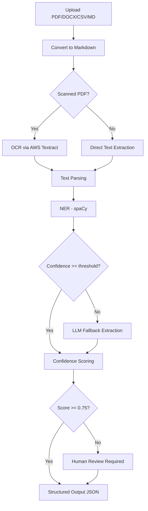

# Document Extraction Pipeline

## Overview

The extraction pipeline converts uploaded documents into structured, validated JSON ready for the Sunbiz form.



---

## Step 1: Upload

- Accept: PDF, DOCX, CSV, Markdown
- Convert all formats to **Markdown** for uniform downstream processing
- Store raw file in **BLOB storage**
- Store Markdown in **CosmosDB** for processing

## Step 2: OCR (Scanned PDFs only)

- Detect if PDF is image-based (scanned)
- If yes: run **AWS Textract** to extract text
- Output: raw text string

## Step 3: Text Parsing

- Extract full text content
- Segment into logical blocks (header, body, lists)

## Step 4: Entity Recognition

### Target Entities

| Entity | Description |
|--------|-------------|
| Company Name | Legal entity name |
| Registered Agent | Name of the registered agent |
| Addresses | Principal, mailing, and agent address blocks |
| Officers | Name, title, and address per officer |

### Tools

1. **spaCy NER** — primary extraction using trained NER model
2. **LLM fallback** — used when spaCy confidence is below threshold

### LLM Extraction Prompt (Example)

```
Extract the following fields from this Articles of Incorporation:
- Company Name
- Registered Agent Name
- Registered Agent Address
- Officers / Directors (name, title, address for each)

Return as JSON.
```

---

## Step 5: Confidence Scoring

Each field receives a weighted confidence score:

- **Rule-based patterns** (regex / keyword proximity): 40%
- **NER model confidence**: 40%
- **LLM certainty signal**: 20%

---

## Step 6: Human Review

If any field score is below the configured threshold (`0.75` default):
- Field is flagged in the review UI
- Submission is **blocked** until the field is manually confirmed or corrected
- All corrections are logged in the audit trail
