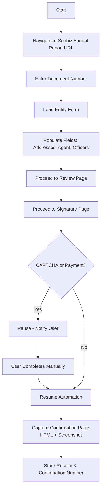

# Sunbiz Integration

## Overview

Sunbiz (Florida Division of Corporations) **does not provide a public API**. All form submissions must be performed via **browser automation** using Playwright.

See also: [Risk & Compliance](../../docs/reference/risk-compliance.md) for legal considerations around automation.

---

## Automation Flow



**Target URL:**
```
https://services.sunbiz.org/Filings/AnnualReport/FilingStart
```

---

## Step-by-Step

1. Navigate to the Sunbiz Annual Report filing start page
2. Input the entity's **Document Number**
3. Wait for the form to load
4. Populate all required fields:
   - Principal Address
   - Mailing Address
   - Registered Agent (name + address)
   - Officers / Directors
5. Proceed through the **Review** page
6. Proceed through the **Signature** page
7. **Pause** for CAPTCHA and/or payment — notify the user
8. Resume after user confirms completion
9. Capture:
   - Confirmation page HTML
   - Full-page screenshot
10. Store confirmation number and receipt

---

## Selector Strategy

Sunbiz form selectors must be **resilient to UI changes**:

| Approach | Usage |
|----------|-------|
| Label-based matching | Primary — match fields by visible label text |
| XPath fallback | Secondary — when label matching is ambiguous |
| Avoid brittle IDs | Do not rely on auto-generated element IDs |

Selectors are defined in a **configuration layer** (not hardcoded in scripts) so they can be updated without code changes if Sunbiz redesigns its form.

---

## Failure Handling

| Scenario | Behavior |
|----------|----------|
| Network timeout | Retry up to 3 times with exponential backoff |
| Unexpected DOM state | Log selector mismatch, escalate to manual mode |
| CAPTCHA detected | Pause and notify user |
| Payment page | Pause and notify user |
| 3 retries exhausted | Mark submission as failed, require manual intervention |

---

## Files

| File | Description |
|------|-------------|
| `submit.ts` _(planned)_ | Main Playwright submission script |
| `selectors.json` _(planned)_ | Configurable selector map |
